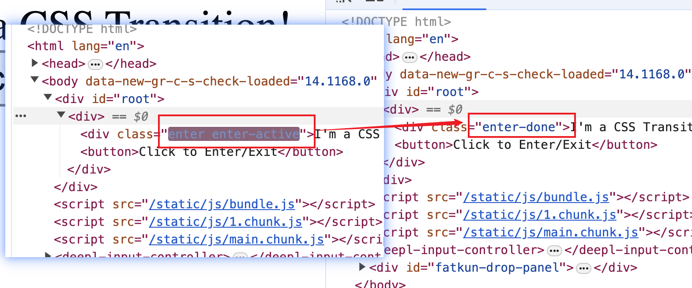
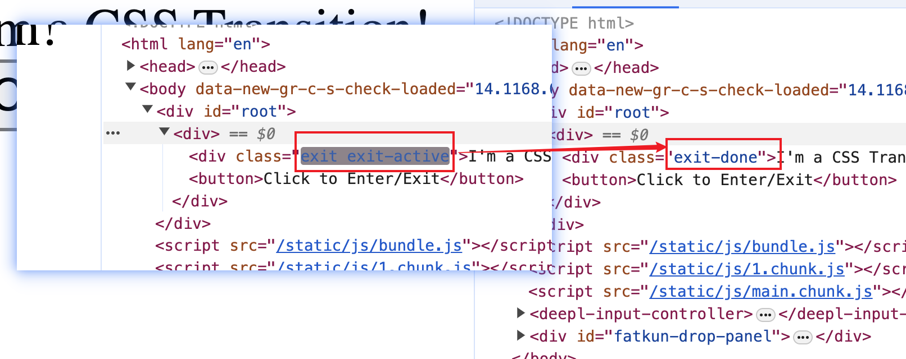

# React动画

1. React动画库：react-transition-group 

2. 地址：npm官网---》search: react-transition-group 

3. 安装使用

    ```bash
    # npm
    npm install react-transition-group --save
    
    # yarn
    yarn add react-transition-group
    ```

4. Components: 包含4个组件

    1. Transition： 最基础的组件，其他组件都建立在这个组件基础上使用

    2. CSSTransition: 最常用

    3. SwitchTransition

    4. TransitionGroup

5. 使用

    1. Transition的使用

        1. 功能初体验：copy 官方文档中的实例代码到自己的工程中，做一些细微的改动

            ```jsx
            import React, { useState } from "react";
            import { Transition } from "react-transition-group";
            
            const duration = 500;
            
            const defaultStyle = {
              transition: `opacity ${duration}ms ease-in-out`,
              opacity: 0,
            };
            const transitionStyles = {
              entering: { opacity: 1 },
              entered: { opacity: 1 },
              exiting: { opacity: 0 },
              exited: { opacity: 0 },
            };
            
            export default function App() {
              const [inProp, setInProp] = useState(false);
              return (
                <div>
                  <Transition in={inProp} timeout={duration}>
                    {(state) => (
                      <div
                        style={{
                          ...defaultStyle,
                          ...transitionStyles[state],
                        }}
                      >
                        I'm a fade Transition!
                      </div>
                    )}
                  </Transition>
                  <button onClick={() => setInProp(!inProp)}>Click to Enter/Exit</button>
                </div>
              );
            }
            
            ```

            点击按钮时，实现div节点显示隐藏的过渡效果

        2. 认识Transition组件

            1. 属性in: 显示组件；触发进入或退出状态  true/false

            2. Timeout: 过渡的时间

            3. children： 一个函数，参数是state, 根据state的值来控制需要返回的内容

            4. 参数state：是4个状态值：entering，entered，exiting，exited

            5. Transition组件通过切换参数状态state的值实现过渡

                ```jsx
                /* ----------------------- 打印state ---------------------- */
                export default function App() {
                  const [inProp, setInProp] = useState(false);
                  return (
                    <div>
                      <Transition in={inProp} timeout={duration}>
                        {(state) => {
                          console.log(state); //  打印出state
                          return (
                            <div
                              style={{
                                ...defaultStyle,
                                ...transitionStyles[state],
                              }}
                            >
                              I'm a fade Transition!
                            </div>
                          );
                        }}
                      </Transition>
                      <button onClick={() => setInProp(!inProp)}>Click to Enter/Exit</button>
                    </div>
                  );
                }
                ```

                初次渲染时

                
            
                点击按钮显示div时

                

                再次点击按钮隐藏div时

                
            
            6. 其他属性：查看官网了解

    2. CSSTransition的使用

        1. 功能初体验

            ```jsx
            import React, { useState } from "react";
            import { CSSTransition } from "react-transition-group";
            
            const duration = 2000;
            
            export default function App() {
              const [visable, setVisable] = useState(true);
              return (
                <div>
                  <CSSTransition in={visable} timeout={duration}>
                    <div>I'm a CSS Transition!</div>
                  </CSSTransition>
                  <button onClick={() => setVisable(!visable)}>Click to Enter/Exit</button>
                </div>
              );
            }
            ```

            点击按钮，查看CSSTransition内部的DOM根元素div的样式变化

            进入Transition状态时：

            

            退出Transition状态时：

            

            点击按钮，实现CSSTransition的进入/退出状态切换

            当进入时，发生：

            ```markdown
            1. 为CSSTransition内部的DOM根元素（后续统一称之为DOM元素）添加样式enter
            2. 在一下帧(enter样式已经完全应用到了元素)，立即为该元素添加样式enter-active
            3. 当timeout结束后，去掉之前的样式，添加样式enter-done
            ```

            当退出时，发生：

            ```markdown
             1. 为CSSTransition内部的DOM根元素（后续统一称之为DOM元素）添加样式exit
             2. 在一下帧(exit样式已经完全应用到了元素)，立即为该元素添加样式exit-active
             3. 当timeout结束后，去掉之前的样式，添加样式exit-done
            ```

        2. 给元素添加的样式，设置具体的内容（编写css样式）,并引入使用

            ```css
            /* App.css */
            .enter {
              opacity: 0;
            }
            .enter-active{
              opacity: 1;
              transition: 2s;
            }
            
            .exit {
              opacity: 1;
            }
            .exit-active{
              opacity: 0;
              transition: 2s;
            }
            
            .exit-done{
              opacity: 0;
            }
            ```

            这样就实现了简单的进入/退出Transition效果了

        3. 设置classNames属性，可以指定类样式的名称

            比如默认名称是“enter-active", 设置classNames属性值为“test"后，样式名变为“test-enter-active” ，其他样式名一次类推

            1. 字符串：为类样式添加前缀

                ```jsx
                import React, { useState } from "react";
                import { CSSTransition } from "react-transition-group";
                import "./App.css";
                
                const duration = 2000;
                
                export default function App() {
                  const [visable, setVisable] = useState(true);
                  return (
                    <div>
                      <CSSTransition
                        in={visable}
                        timeout={duration}
                        // 设定类样式名称
                        classNames="test"
                      >
                        <div>I'm a CSS Transition!</div>
                      </CSSTransition>
                      <button onClick={() => setVisable(!visable)}>Click to Enter/Exit</button>
                    </div>
                  );
                }
                ```

                

            2. 对象：为每个类样式指定具体的名称（非前缀）

                ```jsx
                import React, { useState } from "react";
                import { CSSTransition } from "react-transition-group";
                import "./App.css";
                
                const duration = 2000;
                
                // 类样式名称设置对象
                const myClassNames = {
                  appear: "my-appear",
                  appearActive: "my-active-appear",
                  appearDone: "my-done-appear",
                  enter: "my-enter",
                  enterActive: "my-active-enter",
                  enterDone: "my-done-enter",
                  exit: "my-exit",
                  exitActive: "my-active-exit",
                  exitDone: "my-done-exit",
                };
                
                export default function App() {
                  const [visable, setVisable] = useState(true);
                  return (
                    <div>
                      <CSSTransition
                        in={visable}
                        timeout={duration}
                        // 1.设定类样式名称----->字符串
                        // classNames="test"
                        // 2.设定类样式名称----->对象
                        classNames={myClassNames}
                      >
                        <div>I'm a CSS Transition!</div>
                      </CSSTransition>
                      <button onClick={() => setVisable(!visable)}>Click to Enter/Exit</button>
                    </div>
                  );
                }
                ```

            3. 关于appear样式的说明

                配置首次渲染时的类样式，使用appear属性。

                appear、appear-active、appear-done，它和enter的唯一区别在于完成时，在页面初次加载完成后，会同时加入appear-done和enter-done

                ```jsx
                import React, { useState } from "react";
                import { CSSTransition } from "react-transition-group";
                import "./App.css";
                
                const duration = 2000;
                
                // 类样式名称设置对象
                const myClassNames = {
                  appear: "my-appear",
                  appearActive: "my-active-appear",
                  appearDone: "my-done-appear",
                  enter: "my-enter",
                  enterActive: "my-active-enter",
                  enterDone: "my-done-enter",
                  exit: "my-exit",
                  exitActive: "my-active-exit",
                  exitDone: "my-done-exit",
                };
                
                export default function App() {
                  const [visable, setVisable] = useState(true);
                  return (
                    <div>
                      <CSSTransition
                        in={visable}
                        timeout={duration}
                        // 1.设定类样式名称----->字符串
                        // classNames="test"
                        // 2.设定类样式名称----->对象
                        classNames={myClassNames}
                        // 3. 添加appear属性--->设定页面初次渲染时的样式
                        appear
                      >
                        <div>I'm a CSS Transition!</div>
                      </CSSTransition>
                      <button onClick={() => setVisable(!visable)}>Click to Enter/Exit</button>
                    </div>
                  );
                }
                ```

        4. 综合效果展示

            1. 准备组件

                ```jsx
                import React, { useState } from "react";
                
                function Comp1(visable) {
                  return <h1>组件1</h1>;
                }
                function Comp2(visable) {
                  return <h1>组件2</h1>;
                }
                export default function App() {
                  const [showCom1, setShowCom1] = useState(true);
                  return (
                    <div>
                      <Comp1 visable={showCom1} />
                      <Comp2 visable={!showCom1} />
                      <button onClick={() => setShowCom1(!showCom1)}>显示组件1 / 组件2</button>
                    </div>
                  );
                }
                ```

            2. 使用动画库，配置样式

                ```jsx
                import React, { useState } from "react";
                import { CSSTransition } from "react-transition-group";
                import "./App.css";
                
                function Comp1({ visable }) {
                  return (
                    <CSSTransition in={visable} appear timeout={1000}>
                      <h1 className="title">组件1</h1>
                    </CSSTransition>
                  );
                }
                function Comp2({ visable }) {
                  return (
                    <CSSTransition mountOnEnter in={visable} timeout={1000}>
                      <h1 className="title">组件2</h1>
                    </CSSTransition>
                  );
                }
                export default function App() {
                  const [showCom1, setShowCom1] = useState(true);
                  return (
                    <div className="container">
                      <div className="comp-container">
                        <Comp1 visable={showCom1} />
                        <Comp2 visable={!showCom1} />
                      </div>
                      <button onClick={() => setShowCom1(!showCom1)}>显示组件1 / 组件2</button>
                    </div>
                  );
                }
                ```

                注意：使用appear属性设置页面初次渲染时的动画；使用mountOnEnter属性，配置懒加载：如果该组件没进入Transition状态（in=false), 页面初次渲时，不会加载该组件

            3. 编写样式，并引入使用

                ```css
                /* App.css */
                
                .container{
                  width: 100px;
                  margin: 0 auto;
                }
                .comp-container{
                  position: relative;
                  height: 100px;
                }
                .title{
                  position: absolute;
                  top: 0;
                  left: 0;
                }
                .exit-active{
                  opacity: 0;
                  transition: 1s;
                  transform: translateX(-100px);
                }
                .exit-done{
                  display: none;
                }
                .enter, .appear{
                  display: block;
                  opacity: 0;
                  transform: translateX(100px);
                }
                .enter-active, .appear-active{
                  opacity: 1;
                  transform: translateX(0);
                  transition: 1s ;
                }
                
                ```

        5. 结合animate.css 库的使用

            1. 安装animate.css 库

                ```bash
                yarn add animate.css
                ```

            2. 重新设计组件

                ```jsx
                import React, { useState } from "react";
                import { CSSTransition } from "react-transition-group";
                import "./App.css";
                
                /**
                 * 用于使用CSSTransitio组件实现动画过渡效果
                 * @param {*}
                 * visable: boolean 控制是否进入过渡状态
                 * children: node 组件显示的内容
                 * @returns
                 */
                function MyTransition({ visable, children }) {
                  return (
                    <CSSTransition in={visable} mountOnEnter appear timeout={1000}>
                      {children}
                    </CSSTransition>
                  );
                }
                
                export default function App() {
                  const [showCom1, setShowCom1] = useState(true);
                  return (
                    <div className="container">
                      <div className="comp-container">
                        <MyTransition visable={showCom1}>
                          <h1 className="title">组件1</h1>
                        </MyTransition>
                        <MyTransition visable={!showCom1}>
                          <h1 className="title">组件2</h1>
                        </MyTransition>
                      </div>
                      <button onClick={() => setShowCom1(!showCom1)}>显示组件1 / 组件2</button>
                    </div>
                  );
                }
                ```

            3. 使用animate.css库，并给2个子组件添加固定的animate样式

                ```jsx
                ...
                import "animate.css";
                ...
                <div className="comp-container">
                        <MyTransition visable={showCom1}>
                          <h1 className="title animate__animated animate__slow">组件1</h1>
                        </MyTransition>
                        <MyTransition visable={!showCom1}>
                          <h1 className="title animate__animated animate__slow">组件2</h1>
                        </MyTransition>
                </div>
                ...
                ```

            4. 配置Transition样式对象，使用animate样式

                ```jsx
                import React, { useState } from "react";
                import { CSSTransition } from "react-transition-group";
                import "./App.css";
                import "animate.css";
                
                // CSSTransition样式名对象
                const myClassNames = {
                  // 退出
                  exitActive: "animate__fadeOutLeft",
                  exitDone: "my-exit-done",
                  // 进入
                  enterActive: "animate__fadeInRight",
                  enterDone: "animate__jello",
                  // 页面初次加载时
                  appearActive: "animate__fadeInRight",
                };
                /**
                 * 用于使用CSSTransitio组件实现动画过渡效果
                 * @param {*}
                 * visable: boolean 控制是否进入过渡状态
                 * children: node 组件显示的内容
                 * @returns
                 */
                function MyTransition({ visable, children }) {
                  return (
                    <CSSTransition
                      in={visable}
                      mountOnEnter
                      appear
                      timeout={1000}
                      classNames={myClassNames}
                    >
                      {children}
                    </CSSTransition>
                  );
                }
                
                export default function App() {
                  const [showCom1, setShowCom1] = useState(true);
                  return (
                    <div className="container">
                      <div className="comp-container">
                        <MyTransition visable={showCom1}>
                          <h1 className="title animate__animated animate__fast">组件1</h1>
                        </MyTransition>
                        <MyTransition visable={!showCom1}>
                          <h1 className="title animate__animated animate__fast">组件2</h1>
                        </MyTransition>
                      </div>
                      <button onClick={() => setShowCom1(!showCom1)}>显示组件1 / 组件2</button>
                    </div>
                  );
                }
                ```

                

            5. 编写自定义样式App.css

                ```css
                /* App.css */
                
                .container{
                  width: 100px;
                  margin: 0 auto;
                }
                .comp-container{
                  position: relative;
                  height: 100px;
                }
                .title{
                  position: absolute;
                  top: 0;
                  left: 0;
                }
                .my-exit-done{
                  display: none;
                }
                ```

                

    3. SwitchTransition

        1. 使用场景：用于有秩序的切换内部组件（组件的切换有先后顺序），一般和CSSTransition组件一起使用

        2. 模式mode：out-in 和 in-out 2中模式，默认是out-in模式

        3. out-in模式体验：

            ```jsx
            import React, { useState } from "react";
            import { CSSTransition, SwitchTransition } from "react-transition-group";
            import "./App.css";
            
            export default function App() {
              const [showCom1, setShowCom1] = useState(true);
              return (
                <div className="container">
                  <div className="comp-container">
                    <SwitchTransition>
                      <CSSTransition timeout={1000} key={showCom1}>
                        <h1>{showCom1 ? "组件1" : "组件2"}</h1>
                      </CSSTransition>
                    </SwitchTransition>
                  </div>
                  <button onClick={() => setShowCom1(!showCom1)}>显示组件1 / 组件2</button>
                </div>
              );
            }
            ```

            执行过程：

            1. 当key值改变时，会将之前的DOM根元素添加退出样式（exit,exit-active)
            2. 退出完成后，将该DOM元素移除
            3. 重新渲染内部DOM元素
            4. 为新渲染的DOM根元素添加进入样式(enter, enter-active, enter-done)

        4. in-out模式体验：

             ```jsx
             ...
             <SwitchTransition mode="in-out">
                       <CSSTransition timeout={3000} key={showCom1}>
                         <h1>{showCom1 ? "组件1" : "组件2"}</h1>
                       </CSSTransition>
             </SwitchTransition>
             ...
             ```

            执行过程：

            1. 重新渲染内部DOM元素，保留之前的元素
            2. 为新渲染的DOM根元素添加进入样式(enter, enter-active, enter-done)
            3. 将之前的DOM根元素添加退出样式（exit,exit-active)
            4. 退出完成后，将该DOM元素移除

        5. 添加自定义样式

            ```css
            /* App.css */
            
            .container{
              width: 100px;
              margin: 0 auto;
            }
            .comp-container{
              position: relative;
              height: 100px;
            }
            .title{
              position: absolute;
              top: 0;
              left: 0;
            }
            .exit-active{
              opacity: 0;
              transition: 1s;
            }
            .enter,.appear{
              opacity: 0;
              
            }
            .enter-active,.appear-active{
              opacity: 1;
              transition: 1s;
            }
            
            ```

        6. 结合animate.css库使用

            ```jsx
            import React, { useState } from "react";
            import { CSSTransition, SwitchTransition } from "react-transition-group";
            import "./App.css";
            import "animate.css";
            
            export default function App() {
              const MyClassNames = {
                exit: "animate__bounceOut",
                enter: "animate__bounceIn",
              };
              const [showCom1, setShowCom1] = useState(true);
              return (
                <div className="container">
                  <div className="comp-container">
                    <SwitchTransition>
                      <CSSTransition
                        appear
                        timeout={800}
                        key={showCom1}
                        classNames={MyClassNames}
                      >
                        <h1 className="animate__animated animate__fast">
                          {showCom1 ? "组件1" : "组件2"}
                        </h1>
                      </CSSTransition>
                    </SwitchTransition>
                  </div>
                  <button onClick={() => setShowCom1(!showCom1)}>显示组件1 / 组件2</button>
                </div>
              );
            }
            ```

            ```css
            /* App.css */
            
            .container{
              width: 100px;
              margin: 0 auto;
            }
            .comp-container{
              position: relative;
              height: 100px;
            }
            .title{
              position: absolute;
              top: 0;
              left: 0;
            }
            ```

            

        7. 备注：**该库寻找dom元素的方式，是使用已经过时的API：findDomNode，该方法可以找到某个组件下的DOM根元素**

    4. TransitionGroup

        1. 说明：该组件的children，接收多个Transition或CSSTransition组件，该组件用于根据这些子组件的key值，控制他们的进入和退出状态

        2. 代码实现

            ```jsx
            import React, { useState } from "react";
            import { CSSTransition, TransitionGroup } from "react-transition-group";
            import { v4 as uuid } from "uuid";
            import "./App.css";
            import "animate.css";
            
            export default function App() {
              const MyClassNames = {
                exitActive: "animate__fadeOutLeft",
                enterActive: "animate__fadeInRight",
                appear: "animate__fadeInRight",
              };
              const [taskslist, setTaskslist] = useState([
                { id: uuid(), name: "task 1" },
                { id: uuid(), name: "task 2" },
                { id: uuid(), name: "task 3" },
                { id: uuid(), name: "task 4" },
              ]);
              return (
                <div className="container">
                  <TransitionGroup appear>
                    {taskslist.map((t) => (
                      <CSSTransition timeout={1000} key={t.id} classNames={MyClassNames}>
                        <div className="animate__animated animate__fast">
                          <span>{t.name}</span>
                          <button
                            onClick={() => {
                              const newTasksList = taskslist.filter(
                                (task) => task.id !== t.id
                              );
                              setTaskslist(newTasksList);
                            }}
                          >
                            删除
                          </button>
                        </div>
                      </CSSTransition>
                    ))}
                  </TransitionGroup>
                  <div className="addBtn">
                    <button
                      onClick={() => {
                        let name = window.prompt("请输入一个任务");
                        setTaskslist([...taskslist, { id: uuid(), name: name }]);
                      }}
                    >
                      添加一个任务
                    </button>
                  </div>
                </div>
              );
            }
            
            ```

            ```css
            /* App.css */
            
            .container{
              width: 200px;
              margin: 0 auto;
            }
            
            .addBtn{
             margin-top: 20px;
            }
            ```

            

6. 封装自己的Transition组件

    1. 说明：

        1. Transition组件它本身不提供动画功能，只是提供并管理动画类名。具体的动画操作可以使用animate.css库，或者自定义编写

        2. 在一个项目中，可以把实现动画的功能进行封装，即自定义封装一个通用的动画组件，这样，需要的地方就可以直接使用了

    2. 代码实现

        1. common文件夹中添加新的文件夹，并创建组件FadeTransition

            ```jsx
            import React from "react";
            import "./index.css";
            import { CSSTransition } from "react-transition-group";
            
            // 设置默认属性
            FadeTransition.defaultProps = {
              timeout: 500,
            };
            
            /**
             * 封装fade效果的动画组件，已经编写完成了统一的fade动画效果
             * @param {*} props
             * classNames="fade"： 其他定义的样式会被覆盖，不允许自定义动画样式
             * @returns
             */
            export default function FadeTransition(props) {
              return (
                <div>
                  <CSSTransition
                    {...props}
                    // 自定义类名，会覆盖掉用户自定义传入的类名--》不允许使用其他的样式
                    classNames="fade"
                  >
                    {props.children}
                  </CSSTransition>
                </div>
              );
            }
            ```

            ```css
            /* index.css */
            
            .fade-exit-active{
              opacity: 0;
              transition: 500ms;
            }
            .fade-exit-done{
              opacity: 0;
            }
            .fade-enter{
              opacity: 0;
            }
            .fade-enter-active{
              opacity: 1;
              transition: 500ms;
            }
            ```

        2. 优化：让用户可以配置transition的时间，这时，transition就不能写在css样式表中了，使用Transition组件提供的事件属性（onEntering, onEntered, onExiting, onExited)，手动给node添加或移除transition样式.

            ```jsx
            import React from "react";
            import "./index.css";
            import { CSSTransition } from "react-transition-group";
            
            // 设置默认属性
            FadeTransition.defaultProps = {
              timeout: 1000,
            };
            
            /**
             * 封装fade效果的动画组件，已经编写完成了统一的fade动画效果
             * @param {*} props
             * classNames="fade"： 其他定义的样式会被覆盖，不允许自定义动画样式
             * @returns
             */
            export default function FadeTransition(props) {
              function addTransition(node) {
                node.style.transition = `opacity ${props.timeout}ms`;
              }
              function removeTransition(node) {
                node.style.transition = ``;
              }
              return (
                <div>
                  <CSSTransition
                    appear
                    {...props}
                    // 自定义类名，会覆盖掉用户自定义传入的类名--》不允许使用其他的样式
                    classNames="fade"
                    // 使用事件hook，手动设置style.transition
                    onEntering={addTransition}
                    onEntered={(node) => {
                      removeTransition(node);
                      props.onEntered && props.onEntered(node, props.show);
                    }}
                    onExiting={addTransition}
                    onExited={(node) => {
                      removeTransition(node);
                      props.onExited && props.onExited(node);
                    }}
                  >
                    {props.children}
                  </CSSTransition>
                </div>
              );
            }
            ```

            ```css
            /* index.css */
            
            .fade-exit-active, .fade-exit-done,.fade-enter,.fade-appear{
              opacity: 0;
            }
            
            .fade-enter-active,.fade-appear-active{
              opacity: 1;
            }
            ```

        3. 结合SwitchTransition使用

            ```jsx
            import React, { useState } from "react";
            import FadeTransition from "./common/FadeTransition";
            import "./App.css";
            import { SwitchTransition } from "react-transition-group";
            
            export default function App() {
              const [show, setShow] = useState(true);
              return (
                <div className="container">
                  <SwitchTransition>
                    <FadeTransition key={show}>
                      <h1>{show ? "标题内容1" : "标题内容2"}</h1>
                    </FadeTransition>
                  </SwitchTransition>
            
                  <button onClick={() => setShow(!show)}>切换内容</button>
                </div>
              );
            }
            ```
