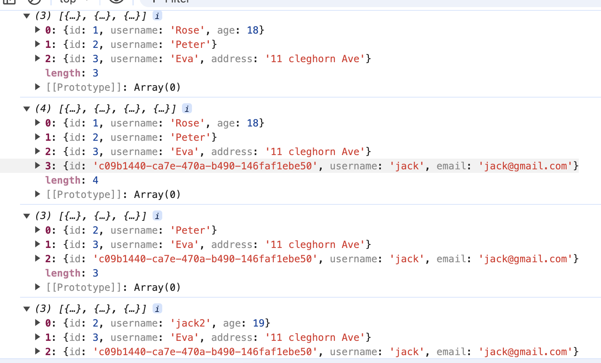

### Reducer

#### Reducer是用于改变数据的函数

#### 一个数据仓库，有且仅有一个reducer，并且通常情况下，一个工程只有一个仓库，因此，一个系统，只有一个reducer

#### 为了方便管理，通常会将reducer放到单独的文件中。

1. 新建文件夹，并创建reducer文件

    ```js
    // reducer/index.js
    
    import * as actionTypes from "../action/action-type";
    
    export function reducer(state, action) {
      // 本身要返回新的状态（数据）
      if (action.type === actionTypes.INCREMENT) {
        return state + 1;
      } else if (action.type === actionTypes.DECREMENT) {
        return state - 1;
      } else if (action.type === actionTypes.SET) {
        return action.payload;
      } else return state;
    }
    ```

2. 导出使用reducer

    ```js
    import { legacy_createStore as createStore, bindActionCreators } from "redux";
    import * as numberActions from "./action/number-action";
    import { reducer } from "./reducer/index";
    
    /* ------- 1. 使用redux提供的数据仓库store（使用createStore方法） ------ */
    const store = createStore(reducer, 10); // store里的初始状态设为10
    console.log(store.getState()); // 10 查看状态的初始值
    
    /* ----- 2.使用bindActionCreators函数创建增强版action，并自动完成分发 ---- */
    const bindNumberActions = bindActionCreators(numberActions, store.dispatch);
    bindNumberActions.getIncreaseAction();
    console.log(store.getState()); // 11 更新成功
    
    
    ```

#### reducer被调用的时机

1. 通过store.dispatch，分发了一个action，此时，会调用reducer

2. 当创建一个store的时候，会调用一次reducer
   1. 可以利用这一点，用reducer初始化状态
   2. 创建仓库时，不传递任何默认状态
   3. 将reducer的参数state设置一个默认值
   
   ```js
   
   // 在reducer中初始化状态：state = 100
   export function reducer(state = 100, action) {
     ...
   }
   ```
   
   ```js
   ...
   /* ------- 1. 使用redux提供的数据仓库store（使用createStore方法） ------ */
   const store = createStore(reducer); // 不设置初始状态，默认值为undefined
   ...
   ```

#### reducer内部通常使用switch来判断type值

1. 改写reducer函数

    ```js
    ...
    export function reducer(state = 100, action) {
      switch (action.type) {
        case actionTypes.INCREMENT:
          return state + 1;
        case actionTypes.DECREMENT:
          return state - 1;
        case actionTypes.SET:
          return action.payload;
        default:
          return state;
      }
    }
    ```

2. 使用reducer函数

#### **reducer必须是一个没有副作用的纯函数**

1. 为什么需要纯函数
   1. 纯函数有利于测试和调式
   2. 有利于还原数据
   3. 有利于将来和react结合时的优化
2. 具体要求
   1. 不能改变参数，因此若要让状态变化，必须得到一个新的状态
   2. 不能有异步
   3. 不能对外部环境造成影响

#### 由于在大中型项目中，操作比较复杂，数据结构也比较复杂，因此，需要对reducer进行细分。

1. redux提供了方法，可以帮助我们更加方便的合并reducer

2. combineReducers: 合并reducer，得到一个新的reducer，该新的reducer管理一个对象，该对象中的每一个属性交给对应的reducer管理。

3. 代码实例练习

    1. 需求：同一个项目，需要统一管理已登录用户数据，所有用户数据等等，将各自的数据单独使用一个reducer处理，最后合并成一个reducer

    2. 处理已登录用户数据

        - 创建单独的action： loginUserAction.js

            ```js
            export const SETLOGINUSER = "set-login-user";
            
            export const getSetLoginUser = (user) => ({
              type: SETLOGINUSER,
              payload: user,
            });
            
            ```

        - 编写单独的reducer： loginUserReducer.js

            ```js
            import { SETLOGINUSER } from "../action/loginUserAction";
            
            const initialState = {};
            export const reducer = (state = initialState, { type, payload }) => {
              switch (type) {
                case SETLOGINUSER:
                  return payload;
            
                default:
                  return state;
              }
            };
            ```

        - 导出action和reducer并使用，测试是否成功

            ```js
            import { legacy_createStore as createStore, bindActionCreators } from "redux";
            import * as loginUserActions from "./action/loginUserAction";
            import { reducer } from "./reducer/loginUserReducer";
            import { v4 as uuid } from "uuid";
            
            /* ------- 1. 使用redux提供的数据仓库store（使用createStore方法） ------ */
            const store = createStore(reducer); // 不设置初始状态，默认值为undefined
            console.log(store.getState()); // undefined 查看状态的初始值
            
            /* ----- 2.使用bindActionCreators函数创建增强版action，并自动完成分发 ---- */
            const bindLoginUserActions = bindActionCreators(
              loginUserActions,
              store.dispatch
            );
            bindLoginUserActions.getSetLoginUser({ id: uuid(), username: "jack" });
            console.log(store.getState()); 
            ```

    3. 处理所有用户数据

        - 创建单独的action： usersAction.js

            ```js
            export const ADDUSER = "add-user";
            export const DELETEUSER = "delete-user";
            export const UPDATEUSER = "update-user";
            
            export const getAddUser = (user) => ({
              type: ADDUSER,
              payload: user,
            });
            
            export const getDeleteUser = (id) => ({
              type: DELETEUSER,
              payload: id,
            });
            
            export const getUpdateUser = (id, newUserData) => ({
              type: UPDATEUSER,
              payload: { ...newUserData, id },
            });
            
            ```

        - 编写单独的reducer： usersReducer.js

            ```js
            import { ADDUSER, DELETEUSER, UPDATEUSER } from "../action/usersAction";
            
            const initialState = [
              { id: 1, username: "Rose", age: 18 },
              { id: 2, username: "Peter" },
              { id: 3, username: "Eva", address: "11 cleghorn Ave" },
            ];
            
            export const reducer = (state = initialState, { type, payload }) => {
              switch (type) {
                case ADDUSER:
                  return [...state, payload];
                case DELETEUSER:
                  return state.filter((u) => u.id !== payload);
                case UPDATEUSER:
                  return state.map((u) => (u.id === payload.id ? { ...u, ...payload } : u));
                default:
                  return state;
              }
            };
            
            ```

        - 导出action和reducer并使用，测试是否成功

            ```js
            import { legacy_createStore as createStore, bindActionCreators } from "redux";
            import * as usersActions from "./action/usersAction";
            import { reducer } from "./reducer/usersReducer";
            import { v4 as uuid } from "uuid";
            
            /* ------- 1. 使用redux提供的数据仓库store（使用createStore方法） ------ */
            const store = createStore(reducer); // 不设置初始状态，默认值为undefined
            console.log(store.getState()); // undefined 查看状态的初始值
            
            /* ----- 2.使用bindActionCreators函数创建增强版action，并自动完成分发 ---- */
            const bindLUsersActions = bindActionCreators(usersActions, store.dispatch);
            const { getAddUser, getDeleteUser, getUpdateUser } = bindLUsersActions;
            
            getAddUser({id: uuid(), username: "jack", email: "jack@gmail.com"});
            console.log(store.getState());
            
            getDeleteUser(1);
            console.log(store.getState());
            
            getUpdateUser(2, { username: "jack2", age: 19 });
            console.log(store.getState());
            
            ```

            

    4. 合并所以reducer并使用 

        1. 自定义新的reducer，用来合并所以分支reducer

            - 创建新的reducer

            ```js
            // 创建新的reducer，用来合并所以的分支reducer
            import { loginUserReducer } from "../reducer/loginUserReducer";
            import { usersReducer } from "../reducer/usersReducer";
            
            const initialState = {};
            export const reducer = (state = initialState, action) => {
              const newState = {
                loginUserState: loginUserReducer(state.loginUserState, action),
                usersState: usersReducer(state.usersState, action),
              };
              return newState;
            };
            ```

            - 使用新的reducer

            ```js
            import { legacy_createStore as createStore, bindActionCreators } from "redux";
            import * as loginUserActions from "./action/loginUserAction";
            import * as usersActions from "./action/usersAction";
            import { reducer } from "./reducer/index";
            import { v4 as uuid } from "uuid";
            
            /* ------- 1. 使用redux提供的数据仓库store（使用createStore方法） ------ */
            const store = createStore(reducer); // 不设置初始状态，默认值为undefined
            console.log(store.getState()); // undefined 查看状态的初始值
            
            /* ----- 2.使用bindActionCreators函数创建增强版action，并自动完成分发 ---- */
            
            /* ------------------- 2.1 测试loginUser ------------------ */
            const bindLoginUserActions = bindActionCreators(
              loginUserActions,
              store.dispatch
            );
            const { getSetLoginUser } = bindLoginUserActions;
            getSetLoginUser({ username: "kate", password: "123456" });
            console.log(store.getState());
            
            /* --------------------- 2.2 测试users -------------------- */
            const bindUsersActions = bindActionCreators(usersActions, store.dispatch);
            const { getAddUser, getDeleteUser, getUpdateUser } = bindUsersActions;
            getAddUser({
              id: uuid(),
              username: "jack",
              email: "jack@gmail.com",
            });
            console.log(store.getState());
            getDeleteUser(1);
            console.log(store.getState());
            getUpdateUser(2, { username: "jack2", age: 19 });
            console.log(store.getState());
            
            ```

            

        2. 使用redux库提供的combineReducers

            - 替换掉自定义的reducer

            ```js
            // 创建新的reducer，用来合并所以的分支reducer
            import { loginUserReducer } from "../reducer/loginUserReducer";
            import { usersReducer } from "../reducer/usersReducer";
            import { combineReducers } from "redux";
            
            /* ------------- 使用redux库提供的combineReducers ------------- */
            export const reducer = combineReducers({
              loginUser: loginUserReducer,
              users: usersReducer,
            });
            
            ```

            