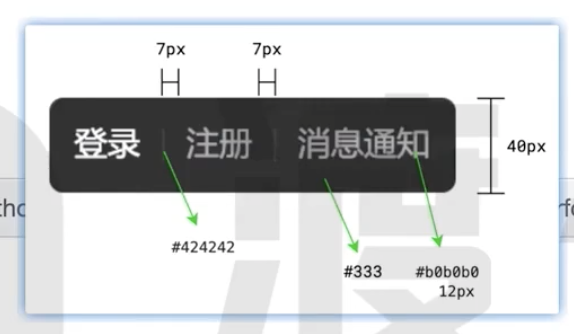
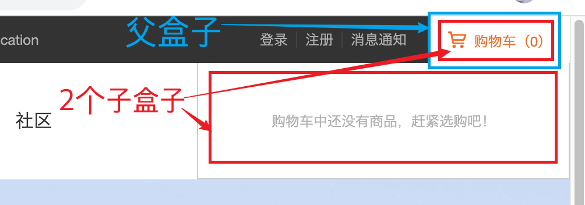
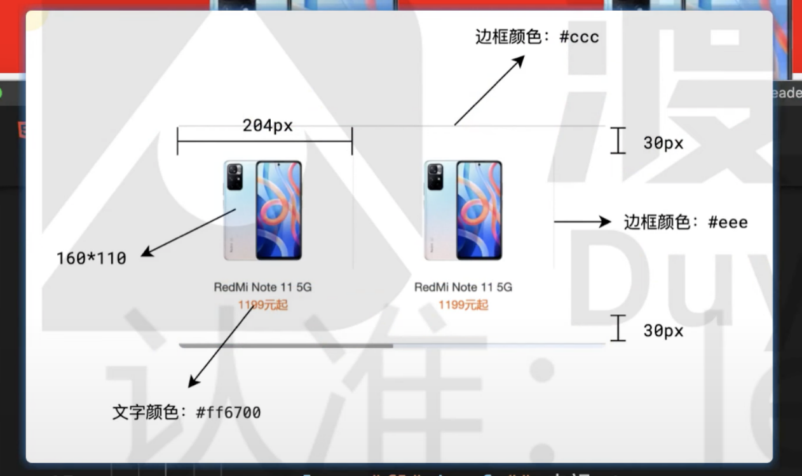
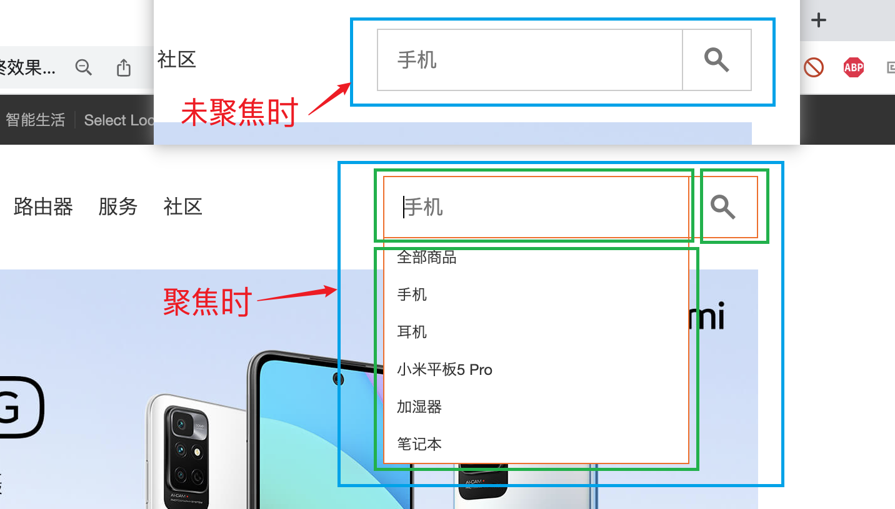
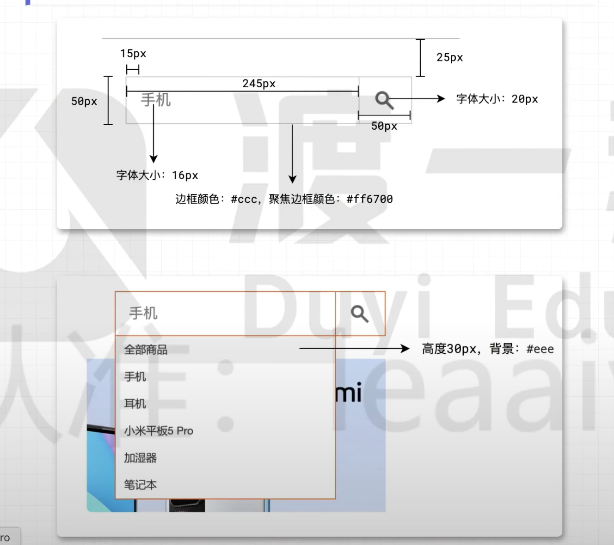
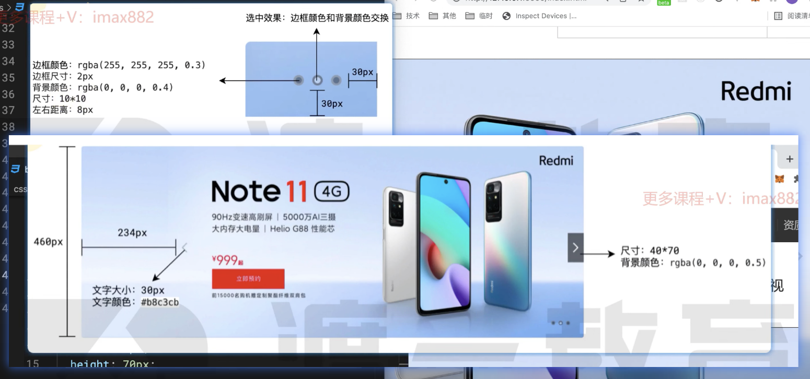
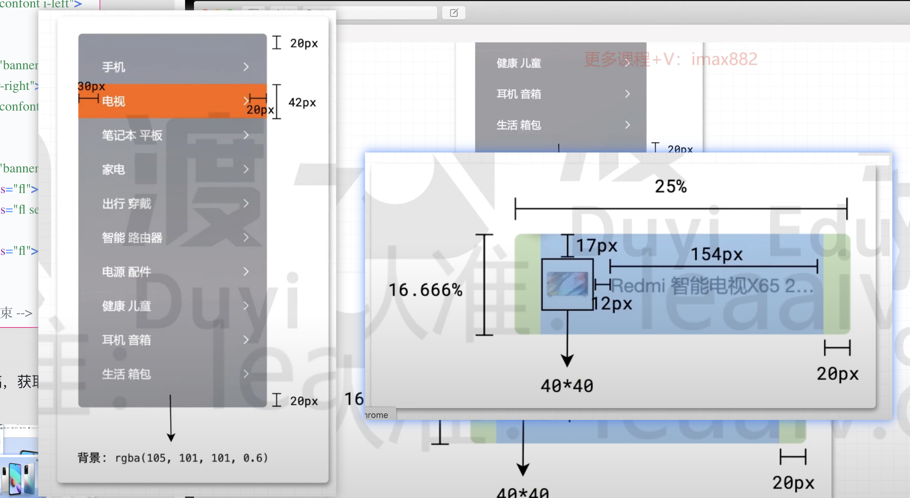
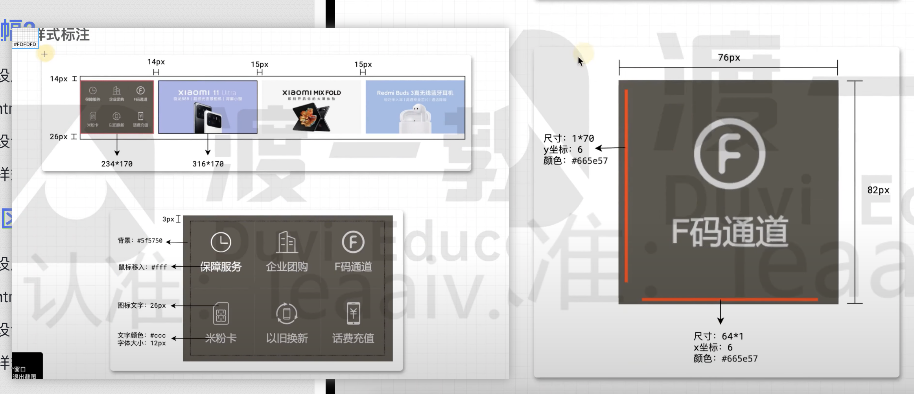
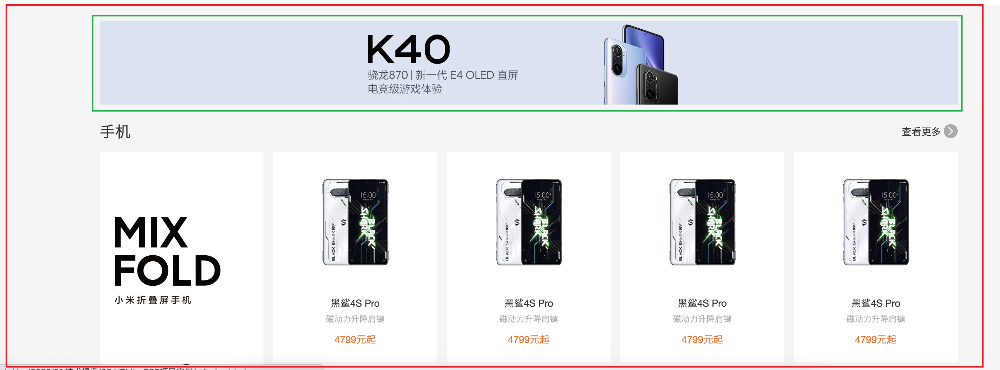
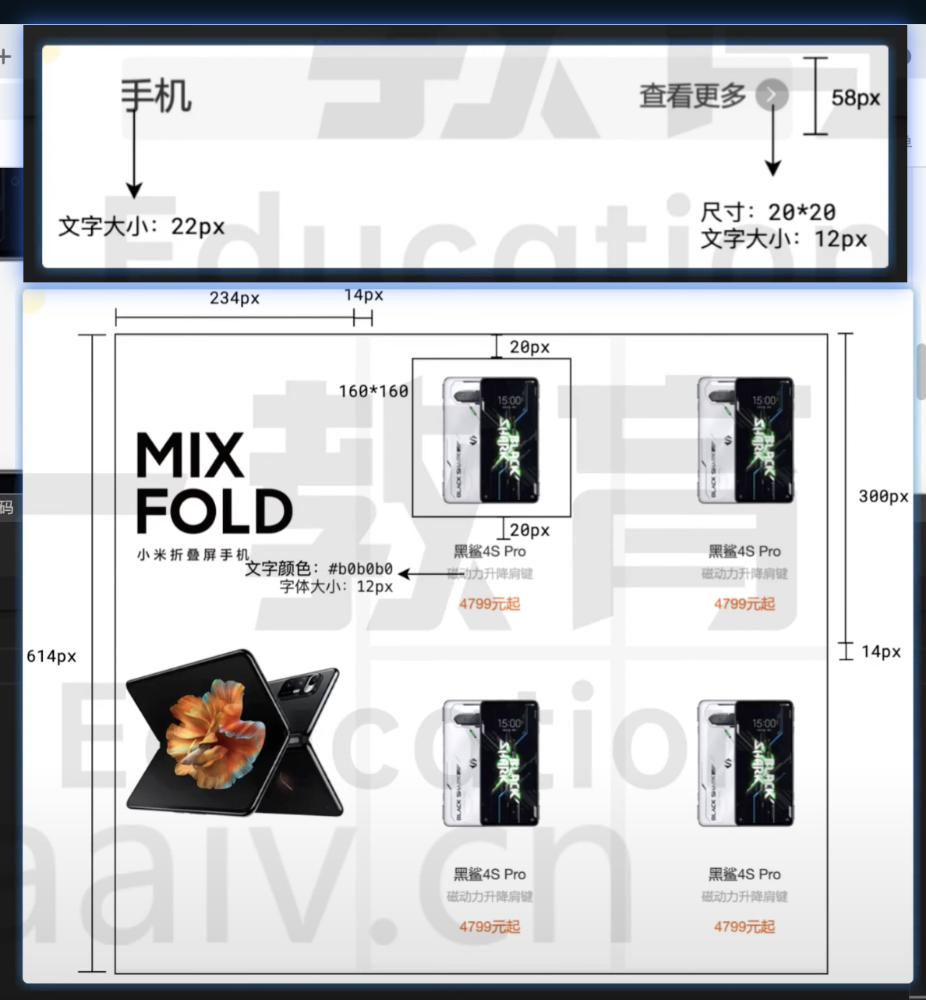

## 02 HTML+CSS项目实战

### 	[01. 搭建工程](https://www.youtube.com/watch?v=71aRpqQI2-A&list=PLRxJGZOBxjTNIhex5oh44bl9QH2R7AuXl&index=15)

1. 创建项目文件夹

    1. 准备项目图片素材
    2. 创建首页index文件，并引入favicon图标
    3. 创建css文件夹，并创建通用样式表common.css，引入到html文件中

2. 编写通用样式: common.css中编写

    1. 统一样式

    ```css
    /* 通用的css代码 */
    * {
      margin: 0;
      padding: 0;
      list-style: none;
      box-sizing: border-box;
    }
    *::before,
    *::after {
      box-sizing: border-box;
    }
    a {
      text-decoration: none;
      color: inherit;
    }
    a:hover {
      color: #ff6700;
    }
    html {
      color: #333;
      min-width: 1226px;
      font: 14px/1.5 'Helvetica Neue', Helvetica, Arial, 'Microsoft Yahei',
        'Hiragino Sans GB', 'Heiti SC', 'WenQuanYi Micro Hei', sans-serif;
    }
    ```

    2. 浮动样式

    ```css
    /* 浮动处理 */
    .fl {
      float: left;
    }
    .fr {
      float: right;
    }
    .clearfix::after {
      content: '';
      display: block;
      clear: both;
    }
    ```

    3. 通用容器样式

    ```css
    /* 通用容器 */
    .container {
      width: 1226px;
      margin-left: auto;
      margin-right: auto;
    }
    ```

    

3. 准备字体图标的引入

    - 这部分属于CSS3的知识，现阶段只需要知道如何使用即可
    - 在页面所有样式之前引入一个CSS
        - [https://at.alicdn.com/t/font_2960521_rqz39d8moo.css](https://gitee.com/link?target=https%3A%2F%2Fat.alicdn.com%2Ft%2Ffont_2960521_rqz39d8moo.css)
    - 打开「字体图标.html」找到自己想使用的图标，复制它对应的类样式
    - 设置任何一个元素的类样式为：iconfont + 对应的图标类样式 即可
        - 学会设置图标的大小、颜色

    

### 	[02. 顶部导航-主区域](https://www.youtube.com/watch?v=PFPCxY6ociE&list=PLRxJGZOBxjTNIhex5oh44bl9QH2R7AuXl&index=16)

1. 根据设计稿，分析导航区布局结构

    

2. 编写顶部导航区html，使用通用样式类名和自定义顶部导航类名

    ```html
    <!-- 头部导航栏 -->
      <div class="topNav">
        <div class="container clearfix">
          <!-- 左侧部分 -->
          <ul class="fl topNav-menu">
            <li class="fl"><a href="">小米商城</a></li>
            <li class="fl"><a href="">MIUI</a></li>
            <li class="fl"><a href="">IoT</a></li>
            <li class="fl"><a href="">云服务</a></li>
            <li class="fl"><a href="">天星数科</a></li>
            <li class="fl"><a href="">有品</a></li>
            <li class="fl"><a href="">小爱开放平台</a></li>
            <li class="fl"><a href="">企业团购</a></li>
            <li class="fl"><a href="">资质证照</a></li>
            <li class="fl"><a href="">协议规则</a></li>
            <li class="fl"><a href="">下载app</a></li>
            <li class="fl"><a href="">智能生活</a></li>
            <li class="fl"><a href="">Select Location</a></li>
          </ul>
          <!-- 右侧部分 -->
          <div class="fr">
            <!-- 登录注册通知部分 -->
            <ul class="fl topNav-menu">
              <li class="fl"><a href="">登录</a></li>
              <li class="fl"><a href="">注册</a></li>
              <li class="fl"><a href="">消息通知</a></li>
            </ul>
            <!-- 购物车部分 -->
            <div class="fr"></div>
          </div>
        </div>
      </div>
    ```

3. 根据设计文稿，获取样式数据

    

4. 编写顶部导航区样式

    ```css
    /* topNav.css文件中编写 */
    
    .topNav {
      background: #333;
      height: 40px;
      color: #b0b0b0;
      font-size: 12px;
    }
    .topNav-menu {
      line-height: 40px;
    }
    .topNav-menu a {
      padding: 0 7px;
      border-right: 1px solid #424242;
    }
    .topNav-menu li:last-child a{
      border-right: none;
    }
    .topNav-menu li:first-child a{
      padding-left: 0;
    }
    .topNav-menu a:hover{
      color: #fff;
    }
    ```


### 	[03. 顶部导航-购物车](https://www.youtube.com/watch?v=zZqlaWVORAo&list=PLRxJGZOBxjTNIhex5oh44bl9QH2R7AuXl&index=17)

1. 根据设局图分析购物车部分结构

    

2. 编写html结构

    ```html
     <!-- 购物车部分 -->
            <div class="fl topNav-car">
              <!-- 购物车图标部分 -->
              <a href="" class="topNav-link">
                <i class="iconfont i-car"></i>
                <span>购物车(0)</span>
              </a>
              <!-- 鼠标hover时，显示的部分 -->
              <div class="topNav-detail">
                <span>购物车中还没有商品，赶紧选购吧！</span>
              </div>
    
    ```

3. 根据设计文稿，获取样式数据

    

4. 编写购物车样式

    ```css
    /* 购物车部分 */
    .topNav-car {
      width: 128px;
      height: 40px;
      background-color: #424242;
      margin-left: 13px;
      position: relative;
    }
    .topNav-link {
      width: 100%;
      height: 100%;
      display: block;
      text-align: center;
      line-height: 40px;
    }
    .topNav-detail{
      width: 320px;
      height: 100px;
      background-color: #fff;
      color: #ccc;
      text-align: center;
      line-height: 100px;
      border: 1px solid #333;
      position: absolute;
      right: 0;
      top: 40px;
      border-top: 0;
      display: none;
      /* 
      对z-index层级的约定：
      弹出菜单，使用2位数；
      固定菜单，使用1位数 
      */
      z-index: 11;
    }
    
    .topNav-car:hover .topNav-detail{
      display: block;
    }
    
    .topNav-car:hover .topNav-link{
      background-color: #fff;
    }
    ```
    
    备注：防止类名冲突，应该使用多层级类名
    
    ```html
     <a href="" class="topNav-link"> 
         <!-- 而不是 -->
      <a href="" class="link">
    ```
    
    

### 	[04. 头部-Logo和菜单](https://www.youtube.com/watch?v=H1DSo3lqNvg&list=PLRxJGZOBxjTNIhex5oh44bl9QH2R7AuXl&index=8)

1. 根据设局图分析结构

    

2. 编写html结构

    ```html
      <!-- 头部菜单开始 -->
      <div class=" header">
        <div class="container clearfix">
          <!-- logo -->
          <a href="" class="header-logo fl">
            <h1>小米商城</h1>
          </a>
          <!-- 菜单 -->
          <div class="header-menu fl">
            <a class="fl" href="">小米手机</a>
            <a class="fl" href="">红米手机</a>
            <a class="fl" href="">电视</a>
            <a class="fl" href="">笔记本</a>
            <a class="fl" href="">平板</a>
            <a class="fl" href="">家电</a>
            <a class="fl" href="">路由器</a>
            <a class="fl" href="">服务</a>
            <a class="fl" href="">社区</a>
          </div>
          <!-- 搜索 -->
        </div>
      </div>
      <!-- 头部菜单结束 -->
    ```

    

3. 根据设计文稿，获取样式数据

    

4. 编写样式: header.css文件中编写

    ```
    .header{
      height: 100px;
      /* background-color: lightskyblue; */
      line-height: 100px;
    }
    .header-logo h1{
      display: none;
    }
    .header-logo{
      width: 56px;
      height: 56px;
      /* outline: 1px solid ; */
      margin-top: 22px;
      margin-right: 172px;
      background-image: url(../img/logo.png);
      background-size: 100% 100%;
    }
    
    .header-menu a{
      padding: 0 7px;
      font-size: 16px;
    }
    ```

    

### 	[05. 头部-二级菜单](https://www.youtube.com/watch?v=OaS2K4iNcBM&list=PLRxJGZOBxjTNIhex5oh44bl9QH2R7AuXl&index=9)

1. 根据设局图分析结构

    

2. 编写html结构

    ```html
     <!-- 头部菜单开始 -->
      <div class=" header">
        <div class="container clearfix">
          <!-- logo -->
          <a href="" class="header-logo fl">
            <h1>小米商城</h1>
          </a>
          <!-- 菜单 -->
          <div class="header-menu fl">
            <a class="fl" href="">小米手机</a>
         	...省略...
            <a class="fl" href="">社区</a>
    
            <!-- 二级菜单区域 -->
            <div class="header-submenu">
              <div class="container clearfix">
                <!-- 二级菜单 列表项 -->
                <a href="" class="fl">
                  <div class="cover">
                    
                    <div class="name">Redmi Note 11 5G</div>
                    <div class="price">1199元起</div>
                  </div>
                </a>
    
         		... 共6个...
    
              </div>
            </div>
          </div>
          <!-- 搜索 -->
        </div>
      </div>
      <!-- 头部菜单结束 -->
    ```

    

3. 根据设计文稿，获取样式数据

    

4. 编写样式: header.css文件中编写

    ```css
    /* topNav.css文件中编写 */
    /* 给topNav添加相对定位 */
    .topNav {
      background: #333;
      height: 40px;
      color: #b0b0b0;
      font-size: 12px;
      /* 这里是设置二级菜单定位的参考系 */
      position: relative;
    }
    
    
    /* header.css文件中编写 */
    /* 鼠标hover，显示2级菜单 */
    .header-menu:hover .header-submenu{
      display: block;
    }
    /* 二级菜单 */
    .header-submenu{
      /* 注意：这里是相对于TopNav */
      position: absolute;
      /* background-color: #e23737; */
      left: 0;
      top: 140px;
      width: 100%;
      border-top: 1px solid #ccc;
      border-bottom: 1px solid #ccc;
      padding: 30px 0;
      display: none;
    }
    
    .header-submenu .cover{
      width: 204px;
      text-align: center;
      
    }
    .header-submenu .cover img{
      width: 160px;
      height: 110px;
      border-right: 1px solid #eee;
    }
    
    .header-submenu a:last-child .cover img{
      border-right: 0;
    }
    
    .header-submenu .cover .name{
      margin-top: 10px;
    }
    
    .header-submenu .cover .price{
      color: #ff6700;
    }
    ```

    

### [06. 头部-搜索区域](https://www.youtube.com/watch?v=zLKQ0YYhJ1I&list=PLRxJGZOBxjTNIhex5oh44bl9QH2R7AuXl&index=10)

1. 根据设局图分析结构

    

2. 编写html结构

    ```html
    <!-- 搜索 -->
          <!-- 收集表单数据，使用form标签 -->
          <form class="header-search fr">
            <!-- 这里input标签不建议在包裹一层div,为了聚焦时，方便通过兄弟伪元素获取后面的元素 -->
            <input  type="text" class="fl" placeholder="手机" >
            <button type="button" class="search-icon fl">
              <i class="iconfont i-fangdajing"></i>
            </button>
            <div class="search-suggestion">
              <a href="">全部商品</a>
              <a href="">手机</a>
              <a href="">耳机</a>
              <a href="">笔记本</a>
            </div>
          </form>
    ```

    

3. 根据设计文稿，获取样式数据

    

4. 编写样式: header.css文件中编写

    ```css
    /* search区域 */
    .header-search{
      margin-top: 25px;
      /* background: #6cdb04; */
      position: relative;
    }
    .header-search input{
      width: 245px;
      height: 50px;
      outline: none;
      border: 1px solid #ccc;
      padding: 0 15px;
      font-size: 16px;
    }
    .header-search input:hover{
      border: 2px solid #aaa;
    }
    .header-search .search-icon{
      width: 50px;
      height: 50px;
      border: 1px solid #ccc;
      border-left: 0;
      font-size: 20px;
      color: #565656;
      cursor: pointer;
    }
    .header-search .search-icon i{
      font-size: inherit ;
    }
    .header-search .search-icon:hover{
      background-color: #ff6700;
      border: none;
      color: white;
    }
    .header-search .search-suggestion{
      position: absolute;
      left: 0;
      top: 50px;
      width: 245px;
      border: 1px solid #ff6700;
      border-top: 0;
      display: none;
    }
    .header-search .search-suggestion a{
      display: block;
      height: 30px;
      line-height: 30px;
      padding: 0 10px;
    }
    .header-search .search-suggestion a:hover{
      background-color: #eee;
      color: inherit;
    }
    .header-search input:focus{
      border: 1px solid #ff6700;
    }
    .header-search input:focus~.search-suggestion{
      display: block;
    }
    .header-search input:focus~.search-icon{
      border: 1px solid #ff6700;
      border-left: 0;
    }
    ```

    

### [07. 横幅-主区域](https://www.youtube.com/watch?v=6xN_z9fwlf4&list=PLRxJGZOBxjTNIhex5oh44bl9QH2R7AuXl&index=11)

1. 根据设局图分析结构

    

2. 编写html结构

    ```html
     <!-- 横幅开始 -->
       <div class="banner container">
        <a href="" class="banner-cover">
          
        </a>
        <div class="banner-pointer banner-pointer-left">
          <i class="iconfont i-left"></i>
        </div>
        <div class="banner-pointer banner-pointer-right">
          <i class="iconfont i-right"></i>
        </div>
        <div class="banner-dots">
          <span class="fl"></span>
          <span class="fl selected"></span>
          <span class="fl"></span>
        </div>
       </div>
        <!-- 横幅结束 -->
    ```

    

3. 根据设计文稿，获取样式数据

    

4. 编写样式

    ```css
    .banner{
      height: 460px;
      position: relative;
    }
    .banner-cover img{
      width: 100%;
      height: 100%;
    }
    .banner-pointer{
      /* outline: 1px solid; */
      width: 40px;
      height: 70px;
      position: absolute;
      top: 50%;
      margin-top:-35px ;
      line-height: 70px;
      text-align: center;
      color: #b8c3cb;
      font-size: 30px;
    }
    .banner-pointer i{
      font-size:inherit;
    }
    .banner-pointer-left{
      left: 234px;
    }
    .banner-pointer-right{
      right: 0;
    }
    .banner-pointer:hover{
      background-color: rgba(0,0,0,0.5);
      color: white;
    }
    
    .banner-dots{
      position: absolute;
      bottom: 30px;
      right: 30px;
      /* outline: 1px solid; */
    }
    .banner-dots span{
      width: 10px;
      height: 10px;
      border-radius: 50%;
      margin: 2px 8px;
      background-color: rgba(0,0,0,0.4);
      border: 2px solid rgba(255,255,255,0.3);
    }
    .banner-dots span.selected{
      background-color: rgba(255,255,255,0.3);
      border: 2px solid  rgba(0,0,0,0.4);
    }
    ```

    

### [08. 横幅-菜单](https://www.youtube.com/watch?v=XbR62vX-lBI&list=PLRxJGZOBxjTNIhex5oh44bl9QH2R7AuXl&index=18)

1. 根据设局图分析结构

    

2. 编写html结构

    ```html
    <!-- 横幅-菜单 -->
        <ul class="banner-menu">
          <li>
            <div class="banner-menu-item clearfix">
              <span class="fl">手机</span>
              <i class="iconfont i-right fr"></i>
            </div>
            <div class="banner-sub-menu">
              <a href="" class="fl">
                
                <span class="fl">Note 11 Pro 系列 Note 11 Pro 系列 Note 11 Pro 系列</span>
              </a>
    				...省略...
            </div>
          </li>
    
          <li>
          	...省略...
          </li>
        </ul>
    ```

    

3. 根据设计文稿，获取样式数据

    

4. 编写样式

    ```css
    /* 菜单样式 */
    .banner-menu{
      width: 234px;
      height: 100%;
      position: absolute;
      top: 0;
      left: 0;
      padding: 20px 0;
      background-color: rgba(105,101,101,0.6);
    }
    
    .banner-menu-item{
     height: 42px;
     line-height: 42px;
     padding:0 20px 0 30px;
     color: white;
     cursor: pointer;
    }
    
    .banner-menu li:hover .banner-menu-item{
      background-color:#ed702e;
    }
    
    /* 二级菜单 */
    .banner-sub-menu{
      position: absolute;
      left: 234px;
      top: 0;
      height: 100%;
      width: 992px;
      background-color: white;
      border: 1px solid #bbb;
      display: none;
    }
    .banner-sub-menu a{
      width: 25%;
      height: 16.666%;
      /* outline: 1px solid ; */
      padding:0 20px ;
    }
    .banner-sub-menu img{
      width: 40px;
      height: 40px;
      margin-top: 17px;
      margin-right: 12px;
    }
    .banner-sub-menu span{
      width: 154px;
    margin-top: 26px;
      /* 文字超出省略号代替 */
      overflow: hidden;
      text-overflow: ellipsis;
      white-space: nowrap;
    
    }
    
    .banner-menu li:hover .banner-sub-menu{
      display: block;
    }
    ```


### [09. 横幅2](https://www.youtube.com/watch?v=l1M20aY_9jY&list=PLRxJGZOBxjTNIhex5oh44bl9QH2R7AuXl&index=19)

1. 根据设局图分析结构

    

2. 编写html结构

    ```html
    <!-- 横幅2开始 -->
      <div class="banner2 container clearfix">
        <div class="banner2-service fl">
          <a href="" class="fl">
            <i class="iconfont i-shijian"></i>
            保障服务
          </a>
          <a href="" class="fl">
            <i class="iconfont i-qiye"></i>
            企业团购
          </a>
          <a href="" class="fl">
            <i class="iconfont i-Fma"></i>
            F码通道
          </a>
          <a href="" class="fl">
            <i class="iconfont i-Sim-Card"></i>
            米粉卡
          </a>
          <a href="" class="fl">
            <i class="iconfont i-yijiuhuanxin"></i>
            以旧换新
          </a>
          <a href="" class="fl">
            <i class="iconfont i-chongzhi"></i>
            话费充值
          </a>
        </div>
        <a href="" class="fl">
          
        </a>
        <a href="" class="fl">
          
        </a>
        <a href="" class="fl">
          
        </a>
      </div>
      <!-- 横幅2结束 -->
    ```

    

3. 根据设计文稿，获取样式数据

    

4. 编写样式

    ```css
    .banner2{
      padding-top: 14px;
      padding-bottom: 26px;
      outline: 1px solid;
    }
    .banner2-service{
      width: 234px;
      height: 170px;
      margin-right: 14px;
      outline: 1px solid ;
      padding: 3px;
      background-color: #5f5750;
      color:#ccc;
      font-size: 12px;
    }
    .banner2-service i{
      font-size: 26px;
      display: block;
    }
    
    .banner2-service a{
      width: 76px;
      height: 82px;
      text-align: center;
      padding-top: 10px;
      position: relative;
    }
    
    .banner2-service a:hover{
    color:white;
    }
    /* 设置左边线 */
    .banner2-service a::before{
      content:'';
      width: 1px;
      height: 70px;
      background: #8a7e75;
      position: absolute;
      top: 6px;
      left:0;
    }
    
    /* 设置右边线 */
    .banner2-service a::after{
      content:'';
      width: 64px;
      height: 1px;
      background: #8a7e75;
      position: absolute;
      bottom: 0;
      left: 6px;
    }
    
    .banner2-service a:nth-child(3n+1)::before{
      content:none;
    }
    
    .banner2-service a:nth-child(n+4)::after{
      content:none;
    }
    
    
    .banner2>a{
      width: 316px;
      height: 170px;
      margin-right: 15px;
    }
    .banner2>a:last-child{
      margin-right: 0;
    }
    
    .banner2>a img{
      width: 100%;
      height: 100%;
    }
    ```

    

### [10. 主区域-广告](https://www.youtube.com/watch?v=a8S352n9kH0&list=PLRxJGZOBxjTNIhex5oh44bl9QH2R7AuXl&index=20)

1. 根据设局图分析结构

    

2. 编写html结构

    ```html
     <!-- 主区域开始 -->
    
      <div class="main">
        <!-- banner3区域 -->
        <a class="container banner3">
          
        </a>
    
      </div>
    
      <!-- 主区域结束 -->
    ```

3. 编写样式

    ```css
    .main{
      padding: 20px 0;
      background: #f5f5f5;
    }
    .banner3{
      display: block;
      /* background: #e90505; */
    }
    
    .banner3 img{
      width: 100%;
      /* 将img转换为块盒，这样可以消除图片对齐方式引起的下边缝隙情况 */
      display: block;
    }
    ```

    

4. **注意**：

    - 图片默认的是行盒，其对齐方式类似于文字，所以当图片充满这个父容器时，其下边会有缝隙

    

    - 解决：将图片转为块盒

### [11. 主区域-橱窗](https://www.youtube.com/watch?v=udvHCUDU-_Y&list=PLRxJGZOBxjTNIhex5oh44bl9QH2R7AuXl&index=21)

1. 根据设局图分析结构

    

2. 编写html结构

    ```html
         <div class="sc container">
            <div class="sc-top clearfix">
              <h2 class="sc-title fl">手机</h2>
              <a href="" class="sc-more fr">
                查看更多
                <i class="iconfont i-right"></i>
              </a>
            </div>
            <div class="sc-container clearfix">
              <div class="sc-item-first fl">
                <a href="">
                  
                </a>
              </div>
              <div class="sc-item-list fl">
                <a href="" class="sc-item fl">
                  
                  <p class="sc-name">黑鲨4S Pro</p>
                  <p class="sc-desc">磁动力升降肩键</p>
                  <p class="sc-price">4799元起</p>
                </a>
             	 ...共8个...
              </div>
            </div>
    ```

3. 根据设计文稿，获取样式数据

    

4. 编写样式

    ```css
    /* 橱窗 */
    .sc {
      margin-top: 10px;
    }
    .sc-top {
      height: 58px;
      line-height: 58px;
    }
    .sc-title {
      font-size: 22px;
      font-weight: normal;
    }
    .sc-more .iconfont {
      background: #aaa;
      width: 20px;
      height: 20px;
      display: inline-block;
      line-height: 20px;
      color: #fff;
      border-radius: 50%;
      text-align: center;
      /* vertical-align: -2px; */
    }
    .sc-more:hover .iconfont {
      background: #ff6700;
    }
    
    .sc-item-first {
      width: 234px;
      height: 614px;
      margin-right: 14px;
    }
    .sc-item-first img {
      width: 100%;
      height: 100%;
    }
    .sc-item-list {
      width: 978px;
    }
    .sc-item {
      background: #fff;
      margin-right: 14px;
      margin-bottom: 14px;
      width: 234px;
      height: 300px;
      text-align: center;
    }
    .sc-item img {
      width: 160px;
      height: 160px;
      margin-top: 20px;
    }
    .sc-name {
      margin-top: 20px;
      color: #333;
    }
    .sc-desc {
      font-size: 12px;
      color: #b0b0b0;
      margin-top: 3px;
      margin-bottom: 10px;
    }
    .sc-price {
      color: #ff6700;
    }
    .sc-item:nth-child(4n) {
      margin-right: 0;
    }
    ```

    

### [12. 页脚](https://www.youtube.com/watch?v=wDhjGE1XjVI&list=PLRxJGZOBxjTNIhex5oh44bl9QH2R7AuXl&index=22)

1. 根据设局图分析结构

    

2. 编写html结构

    ```html
     <!-- 页脚区域 开始 -->
        <div class="footer">
          <div class="container">
            <div class="footer-top clearfix">
              <a class="fl" href="">
                <i class="iconfont i-weixiu1"></i>
                预约维修服务
              </a>
              <a class="fl" href="">
                <i class="iconfont i-7tianwuliyoutuihuo"></i>
                7天无理由退货
              </a>
              <a class="fl" href="">
                <i class="iconfont i-tian"></i>
                15天免费换货
              </a>
              <a class="fl" href="">
                <i class="iconfont i-liwu"></i>
                满69包邮
              </a>
              <a class="fl" href="">
                <i class="iconfont i-didian"></i>
                520余家售后网点
              </a>
            </div>
            <div class="footer-bottom clearfix">
              <div class="footer-links fl">
                <h3>帮助中心</h3>
                <a href="">账号管理</a>
                <a href="">购物指南</a>
                <a href="">订单操作</a>
              </div>
              <div class="footer-links fl">
                <h3>服务支持</h3>
                <a href="">售后政策</a>
                <a href="">自助服务</a>
                <a href="">相关下载</a>
              </div>
              <div class="footer-links fl">
                <h3>线下门店</h3>
                <a href="">小米之家</a>
                <a href="">服务网点</a>
                <a href="">授权体验店/专区</a>
              </div>
              <div class="footer-links fl">
                <h3>关于小米</h3>
                <a href="">了解小米</a>
                <a href="">加入小米</a>
                <a href="">投资者关系</a>
                <a href="">企业社会责任</a>
                <a href="">廉洁举报</a>
              </div>
              <div class="footer-links fl">
                <h3>关注我们</h3>
                <a href="">新浪微博</a>
                <a href="">官方微信</a>
                <a href="">联系我们</a>
                <a href="">公益基金会</a>
              </div>
              <div class="footer-links fl">
                <h3>特色服务</h3>
                <a href="">F 码通道</a>
                <a href="">礼物码</a>
                <a href="">防伪查询</a>
              </div>
              <!-- 联系 -->
              <div class="footer-contact fr">
                <p class="footer-phone">400-100-5678</p>
                <p class="footer-phone-desc">8:00-18:00（仅收市话费）</p>
                <a href="" class="footer-support">
                  <i class="iconfont i-liaotian"></i>
                  人工客服
                </a>
                <p class="footer-subcribe">
                  关注小米：
                  <i class="iconfont i-xinlang"></i>
                  <i class="iconfont i-weixin"></i>
                </p>
              </div>
            </div>
          </div>
        </div>
        <!-- 页脚区域 结束 -->
    ```

    

3. 根据设计文稿，获取样式数据

    

4. 编写样式

    ```css
    /* 页脚-顶部 */
    
    .footer-top {
      padding: 27px 0;
      border-bottom: 1px solid #e0e0e0;
      height: 75px;
      color: #616161;
    }
    .footer-top a {
      /* outline: 1px solid; */
      width: 20%;
      font-size: 16px;
      text-align: center;
      height: 20px;
      line-height: 20px;
      border-right: 1px solid #e0e0e0;
    }
    .footer-top .iconfont {
      font-size: 26px;
      vertical-align: -4px;
    }
    .footer-top a:last-child {
      border-right: none;
    }
    
    /* 页脚-底部 */
    .footer-bottom {
      padding: 40px 0;
    }
    .footer-links {
      width: 160px;
      color: #757575;
    }
    .footer-links h3 {
      font-size: 14px;
      font-weight: normal;
      color: #424242;
      margin-bottom: 17px;
    }
    .footer-links a {
      display: block;
      font-size: 12px;
      margin-top: 10px;
    }
    
    /* 页脚-联系 */
    .footer-contact {
      width: 245px;
      text-align: center;
      border-left: 1px solid #e0e0e0;
      font-size: 12px;
    }
    .footer-phone {
      font-size: 22px;
      color: #ff6700;
    }
    .footer-phone-desc {
      color: #616161;
    }
    .footer-support {
      width: 118px;
      border: 1px solid #ff6700;
      color: #ff6700;
      display: block;
      margin: 6px auto;
      height: 30px;
      line-height: 30px;
    }
    .footer-support .iconfont {
      vertical-align: -1px;
      font-size: 14px;
    }
    .footer-support:hover {
      background: #ff6700;
      color: #fff;
    }
    .footer-subcribe {
      color: #616161;
    }
    .footer-subcribe .iconfont {
      font-size: 20px;
      vertical-align: middle;
      cursor: pointer;
    }
    .footer-subcribe .iconfont:hover {
      color: #ff6700;
    }
    
    ```

    

### [13. 右侧固定菜单](https://www.youtube.com/watch?v=lOmbTBfUamY&list=PLRxJGZOBxjTNIhex5oh44bl9QH2R7AuXl&index=23)

1. 根据设局图分析结构
2. 编写html结构
3. 根据设计文稿，获取样式数据
4. 编写样式

### [14. 右侧二维码弹出](https://www.youtube.com/watch?v=Yxu8kmrxbss&list=PLRxJGZOBxjTNIhex5oh44bl9QH2R7AuXl&index=24)

1. 根据设局图分析结构
2. 编写html结构
3. 根据设计文稿，获取样式数据
4. 编写样式

### [15. 将你的页面分享给全世界](https://www.youtube.com/watch?v=AYo5FWk0vBY&list=PLRxJGZOBxjTNIhex5oh44bl9QH2R7AuXl&index=25)
